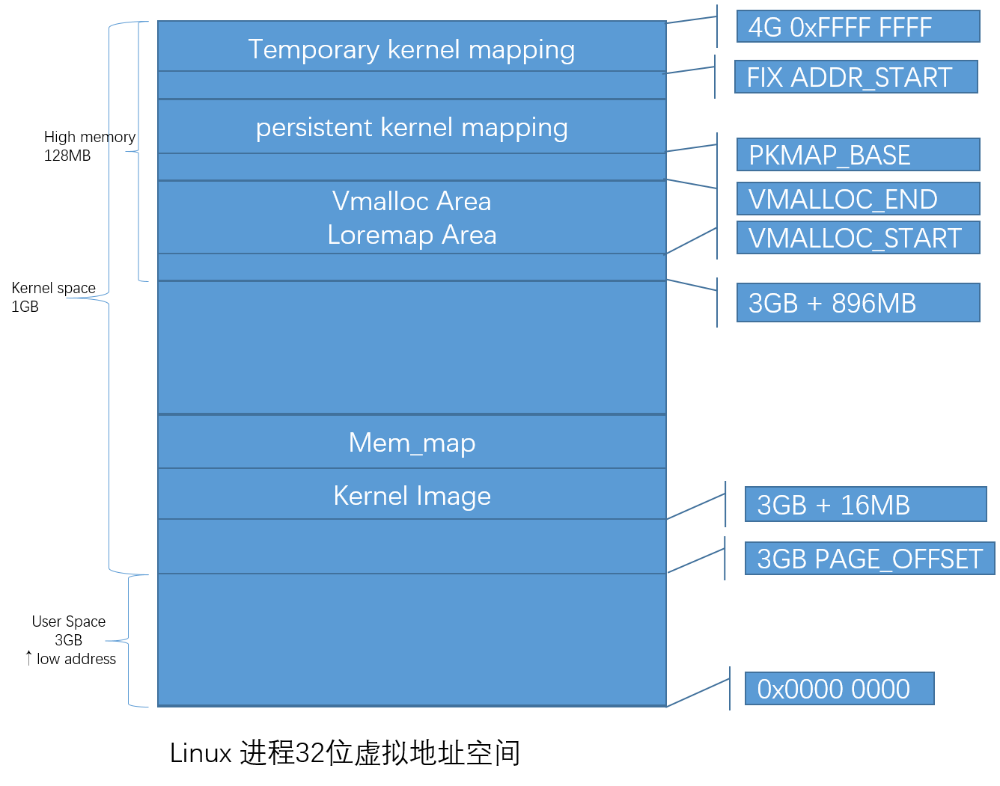
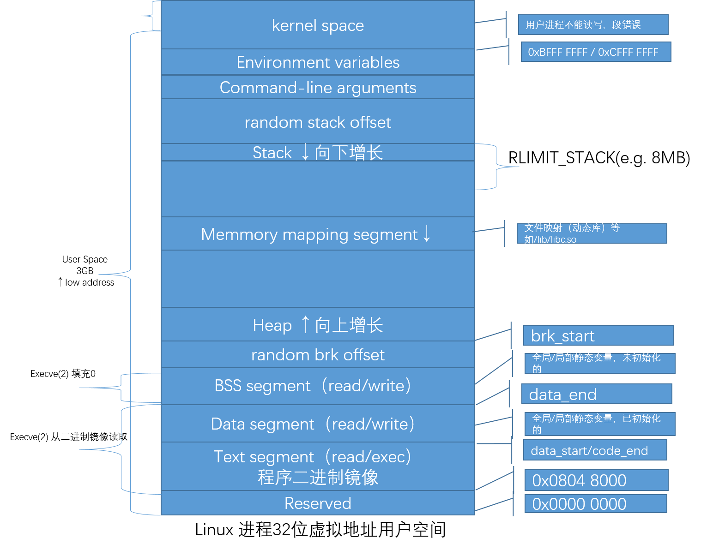

# 进程线程专题
一个程序的执行？操作系统加载到内存，进程地址空间的代码区/数据区/堆/栈/系统保留区？

CPU的运行本质就是机器运行，就像齿轮传动一样。进程有时需要等待某事件，比如操作系统UI程序，一个机器一个进程独占的话，比较浪费，所以多进程模式，这样做更多事情。进程要做很多事，比如office，如果一直等待某事件，比较傻，而多进程又比较重量级，所以多线程，这样更灵活。

进程和线程是从CPU执行抽象出来的概念，与操作系统的PCB（进程控制块）和TCB（线程控制块）相对应。

进程是资源分配和调度的独立单位，线程是CPU调度的单位。
操作系统调度CPU时间片是分配给线程的，进程或线程申请资源都记录进程空间里。

进程有自己的进程地址空间；线程有独立的指令计数器、运行栈；
同一进程的多个线程共享进程的地址空间；不同进程之间共享数据，需要使用操作系统的共享内存。

同一程序的多个进程，一个进程死了，会向父进程发送信号。
同一进程的多个线程，一个线程退出程序或者被杀死，整个进程就退出了。如果线程本身退出，其父线程会收到信号，并做处理。

进程创建和销毁比较消耗资源（耗时，耗内存），线程更轻便。

操作系统不会把资源认为是某个线程独占的，却会认为是某个进程独占，当优先级更高的进程抢占时，也是从该进程抢占，判断死锁也是将该进程杀死。

进程和线程就像部门和成员一样，以部门为单位申请资源，操作系统以部门为单位管理资源。同部门的某些资源可以共用，不同部门的某些资源使用需要申请。当然公司没有CPU来执行某个成员，成员也不用被睡，哈哈。

## 进程

### 进程地址空间

+ 1.进程使用虚拟内存中的地址，操作系统和硬件把它转成物理地址。 虚拟地址通过页表PageTable映射到物理内存
+ 2.内核空间在所有页表中拥有较高特权级别，因此用户态程序访问它将会导致一个页错误。
+ 3.内核空间是持续存在的，并且在所有进程中都映射到同样的物理内存。
+ 4.linux进程在虚拟内存中的标准内存段布局包括高地址的内核空间1GB与底地址用户空间3GB。用户空间地址有高到低包括命令行参数和环境变量、栈、堆、未初始化的数据、初始化的数据、正文。正文段，cpu指令部分，可共享的（内存中多个程序共享一个副本），只读的，写导致错误。初始化数据段，即数据段，包含程序中的全局变量。非初始化数据段，bss段，未初始化的全局变量和静态变量。栈，自动变量及函数调用信息。堆，动态存储分配。堆始于非初始化数据段顶和栈底之间，两者间隔很大。在编译时，函数地址及其他地址就已经确定了。readelf命令可以查看二进制文件中函数入口地址。
+ 5.32位windows，进程高位2G留给内核，低位2G留给用户，所以进程堆的大小小于2G，进程栈的大小默认是1M，vs的编译属性可以修改程序运行时进程的栈大小，一个线程栈的大小默认为1M，所以一个进程最多开2048个线程，实际最多大概2000个。
+ 6.linux下，进程高位1G留给内核，低位3G留给用户，所以进程堆的大小小于3G，进程栈的默认大小是10M，可以通过ulimit -s查看并修改默认栈大小。一个线程栈的大小默认为8M，所以最多380个左右线程。（ulimit -a查看linux的最大进程数大概7000多个。）
+ 7.线程共享的环境包括进程代码段、进程共有数据、进程打开的文件描述符、信号的处理器、进程的当前目录、进程用户ID与进程组ID。线程独立拥有自己的线程ID、寄存器组的指、线程函数栈区、错误返回码、线程信号屏蔽码、线程的优先级。window平台不同线程缺省使用同一个堆，所以用c的malloc分配内存的时候是使用了同步保护的。
+ 8.x86_64下，虚拟地址只用了48位，C程序里打印的地址只有12位16进制地址，48位对应了256TB的地址空间。64位地址前16位，4位16进制地址，全0是用户地址，全F是内核地址，这样分为两个128TB地址空间。内核空间有很多空洞hole，其中仅64TB才是直接映射物理内存的区域，PAGE——OFFSET为ffff8800 00000000
+ 9.pmap -x pid报告进程的内存映射关系
+ 10.malloc/free函数是通过brk，mmap，munmap等实现

## lib库的动态加载和静态加载机制

**堆和栈的区别和适用场景**