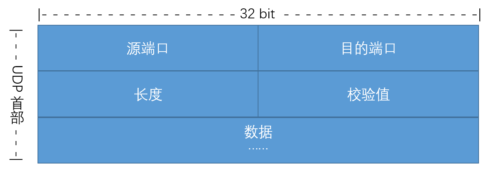

# UDP
UDP，User Datagram Protocol，用户数据报协议，是一种传输层协议。在 TCP/IP 网络中，它与 TCP 协议一样用于处理数据包，是一种无连接的协议。

TCP 协议在进行数据传输时，需要建立连接，并且每次传输的数据都需要进行确认。当不再进行传输数据时，还需要断开连接。这样做虽然安全，但是效率较低。而 UDP 协议正好避免了这些过程，它是一种没有复杂控制，提供面向无连接的通信服务协议。

UDP 协议具备以下特点：
+ 没有各种连接：在传输数据前不需要建立连接，也避免了后续的断开连接。
+ 不重新排序：对到达顺序混乱的数据包不进行重新排序。
+ 没有确认：发送数据包无须等待对方确认。因此，使用 UDP 协议可以随时发送数据，但无法保证数据能否成功被目标主机接收。

UDP协议被广泛用到对网络数据传输的实时性很高，对数据准确性不是非常高的场合，**并且如今网络物理介质的高速提升（光纤）降低了数据丢包的机率，并且当网络状况很好的情况下，UDP的缺点又可以很好的大程度上的被改善。因此UDP协议发展前途无量。**

UDP更适合于消息的多播发布可以向多个点传送消息（因为没有繁琐的握手机制与挥手机制），同时UDP适用于快速传输的协议，对信息的时实性要求严格的协议，所以适合于在线视频媒体，电话视频聊天，qq聊天，电视广播，多人在线游戏这些项目。（为了时实性牺牲写可靠性，即使有包丢失，可能会导致语音不清楚，视频不清楚等问题，不过没有影响）

基于TCP的应用层协议有：SMTP、TELNET、HTTP、FTP

基于UDP的应用层协议：DNS、TFTP（简单文件传输协议）、RIP（路由选择协议）、DHCP、BOOTP（是DHCP的前身）、IGMP（Internet组管理协议）

## UDP 报文

+ 源端口  
可选，发送端不一定写入该字段（而是写0）。业务层接收端可以用这个字段作为发送响应的目的端口。
+ 目的端口
+ 长度  
包括UDP报文头（8byte）和UDP数据长度，最小为8byte。
+ 校验值
校验数据是否被损坏

